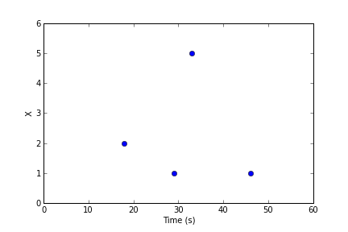
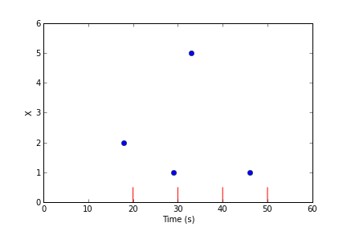
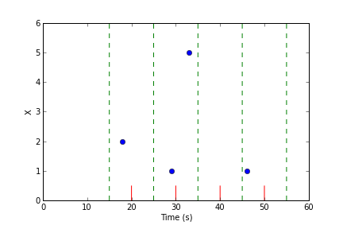

Querying Data
=============

The query interface is the key distinguishing feature of Natural Log.  All queries return a *resampled, uniformly spaced time series* based upon the irregularly spaced raw points recorded in the database.  Raw points can also be retrieved directly from the database, but that is not the primary usage model.

The basic components of a query are:

 * List of data source names
 * Optional resampling strategies for each data source.  (If no resampling
   strategies are given, the default for the data source is used.)
 * Desired time of first point
 * Desired time of last point
 * Desired number of points (must be >= 2)

The result of the query is a 1D array of sample times and a 2D array with the resampled value of each data source (column) at each sample time (row).  To enable storage backends to return results quickly, the actual start and end times, as well as the number of points, returned from the query may be slightly different than the requested values.  How close the query result will match the request depends on the storage backend configuration.


How Resampling Works
********************

Let's suppose we have a time-ordered series of raw data points (floats, in this case) called *X*:



A query comes in asking for 4 data points from t=20 to t=50 seconds.  First, the storage backend decides if it needs to adjust this request for performance reasons.  Assuming it makes no changes to the request, it will need to decide the value of the data source at t=20, 30, 40, and 50 seconds, indicated by the red lines:



To estimate the value of the data source at the given times, the query engine groups the raw data points into equally-spaced bins around each of the evaluation times:



In this example, there are some bins with multiple raw points, and some bins with no points.

.. warning:: To ensure that raw data points can only appear in one bin, bin intervals are defined to be *half open*.  If a raw point equals the value of the lower bin boundary, it is included in the bin, but if it equals the upper bin boundary, is is not included in the bin.

Natural Log uses the following rules to decide the value of each evaluation point:

 1. If the bin contains 1 raw point, that value in the bin is the value of that raw point.
 2. If the bin contains multiple raw points, the *reduction strategy* is used to combine the raw points into a single value.
 3. If the bin contains 0 raw points, the *interpolation strategy* is used to generate a value from adjacent bins.

In the above example, suppose the reduction strategy is ``mean`` and the interpolation strategy is ``linear``, the result of the query will be:

===  ===
*t*  *x*
===  ===
20   2.0
30   3.0
40   4.0
50   1.0
===  ===


.. _reduction:

Reduction Strategies
--------------------

A reduction strategy determines how raw values from a data source should be combined when they fall into the same interval during resampling.

``closest``
```````````
Select the point closest to the center of the time interval.  This is the only allowed option for blob data.

``sum``
```````
Add up the values of all points in the time interval.

``mean``
````````
Add the values of all points in the time interval and divide by the number of points.  Note that each point is weighted equally, regardless of the spacing of points in the time interval.

``min``
```````
Report the minimum value in the interval.

``max``
```````
Report the maximum value in the interval.

.. _interpolation:

Interpolation Strategies
------------------------

An interpolation strategy determines the value of the data source during resampling when no point falls into the interval.

``none``
````````
Return a JSON ``null`` for entries where no data point is present.  This is the only option allowed for blob data.

``zero``
````````
Return zero (or an array of zeros) for entries where no data point is present.  This option is not allowed for blob data.

``previous``
````````````
Return the value of the previous non-empty time interval.  Note that if there is no such interval (due to no data points within the query range), then ``null`` is returned.

``linear``
``````````
Returns a linear interpolation between the non-empty time intervals preceeding and following this time interval.  If non-empty time intervals cannot be found before and after this time interval, ``null`` is returned.


.. _making-query:

Making a Query
**************

The examples in this section assume the Natural Log server is running with the configuration described in :ref:`server-config`.  We continue to use the `Requests <http://docs.python-requests.org/>`_ module::

    import requests
    url_base = 'http://localhost:6283/'


For this example, let's make two new data sources, ``temperature`` and ``humidity``::

    t = {
        'name' : 'temperature',
        'type' : 'float32',
        'reduction' : 'mean',
        'interpolation' : 'linear',
        'description' : 'Outside Temperature',
        'unit' : 'deg C'
    }

    r = requests.post(url_base + 'create/', data=t)
    assert r.status_code == 200  # Check for success

    t = {
        'name' : 'humidity',
        'type' : 'float32',
        'reduction' : 'mean',
        'interpolation' : 'linear',
        'description' : 'Relative humidity',
        'unit' : '%'
    }

    r = requests.post(url_base + 'create/', data=t)
    assert r.status_code == 200  # Check for success

And let's fill them with some hourly data::

    post_url = url_base + 'data/temperature/'
    for i in xrange(1, 15):
        v = {
            'time'  : '2013-07-24 %02d:00:00' % i,
            'value' : 25.0 + 0.5 * i
        }
        r = requests.post(post_url, data=v)
        assert r.status_code == requests.codes.ok  # Check for errors

    post_url = url_base + 'data/humidity/'
    for i in xrange(1, 15):
        v = {
            'time'  : '2013-07-24 %02d:00:00' % i,
            'value' : 55.0 - 0.2 * i
        }
        r = requests.post(post_url, data=v)
        assert r.status_code == requests.codes.ok  # Check for errors

Now we can create a query for the database that resamples to 4 points and send it::

    q = {
        'selectors' : ['temperature', 'humidity'],
        'first' : '2013-07-24 01:00:00'
        'last'  : '2013-07-24 15:00:00'
        'npoints' : 4,
    }
    
    r = requests.post(post_url, data=t)
    assert r.status_code == requests.codes.ok  # Check for errors
    result = r.json()

Depending on the particular backend settings, the contents of ``result`` could be something like::

    {
        'times' : ['2013-07-24 01:00:00',
                   '2013-07-24 05:00:00',
                   '2013-07-24 09:00:00',
                   '2013-07-24 14:00:00'],
        'values' : [
            [ 25.75, 54.7],
            [ 27.25, 54.1],
            [ 29.25, 53.3],
            [ 31.25, 52.5]
            ]
    }

If a source is an array type, the entries in the ``values`` array will be lists (possibly nested, if the array has multiple dimensions), and if the source is a blob type, the value will be a string containing a URL to retrieve the appropriate blob from the Natural Log server.

The default strategies for the sources (``mean`` and ``linear``) were used in the above query, but we can also decide to override them in the selector using the forms ``name:reduction`` (leaving the interpolation strategy to be the default) or ``name:reduction:interpolation`` (overriding both strategies).

For example, this query::

    q = {
        'selectors' : ['temperature:closest', 'humidity:min'],
        'first' : '2013-07-24 01:00:00'
        'last'  : '2013-07-24 15:00:00'
        'npoints' : 4,
    }
    
    r = requests.post(post_url, data=t)
    assert r.status_code == requests.codes.ok  # Check for errors
    result = r.json()

returns the following result::

    {
        'times' : ['2013-07-24 01:00:00',
                   '2013-07-24 05:00:00',
                   '2013-07-24 09:00:00',
                   '2013-07-24 14:00:00'],
        'values' : [
            [ 25.5, 54.6],
            [ 27.5, 53.8],
            [ 29.5, 53.0],
            [ 31.5, 52.2]
            ]
    }

.. _continuous-query:

Continuous Queries
******************
Rather than polling for new data, you can subscribe to changes and receive updates pushed from the server via server-sent events (SSE). In this case, the results are sent as a series of (time, value) pairs rather than a list of times and a list of values. This mode is selected by leaving the parameter *last* out of the query.

